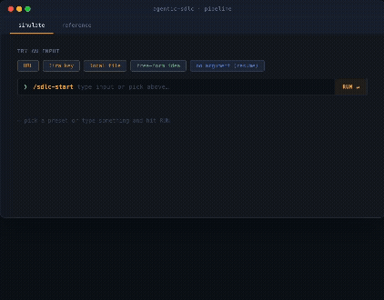
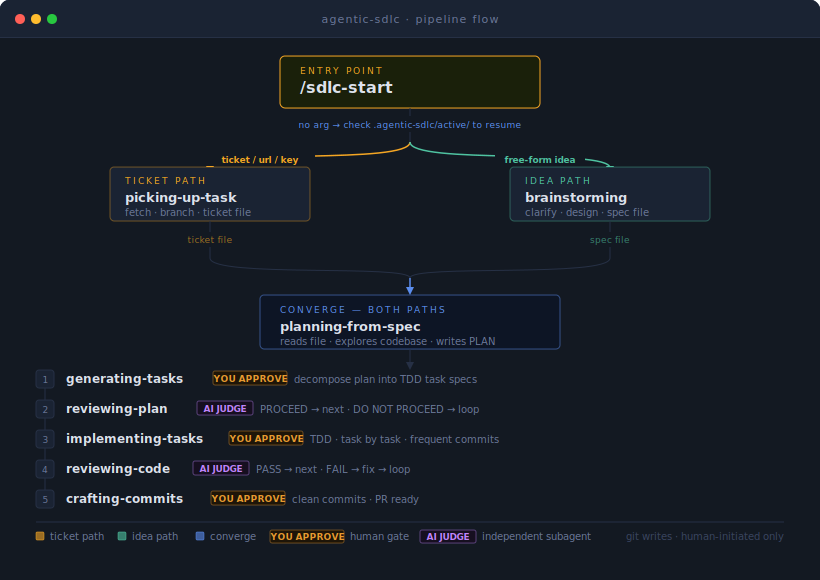

# agentic-sdlc



A spec-driven SDLC pipeline for AI coding agents. Start from an idea, a ticket, or a URL — finish with a reviewed PR.

> *Review early, review often.* A flaw surfaced before coding costs nothing. The same flaw after five tasks can invalidate all five.

Works with Claude Code, OpenCode, Cursor, and GitHub Copilot.

## Install

One command. Works on macOS, Linux, WSL, Git Bash.

```bash
curl -fsSL https://raw.githubusercontent.com/mhihasan/agentic-sdlc/main/install.sh | bash
```

Specific tool or project-scoped? → [docs/INSTALL.md](docs/INSTALL.md)


## Quickstart

**Start anything — ticket, idea, or resume in-progress work:**

```
/sdlc-start https://yoursite.atlassian.net/browse/PROJ-123
/sdlc-start "add dark mode toggle"
/sdlc-start
```

Detects input type and routes automatically. No argument resumes in-progress work. Enter at any step if the upstream artifact already exists.

→ [Full usage: modes, routing rules, resume logic, active state](commands/references/sdlc-start-usage.md)

---

**Review any branch right now:**

```
/reviewing-code
```

Reviews your staged diff by default, or pass `branch`, a PR number, or a diff file. Dispatches parallel AI judges, filters the diff by domain, produces a triage-first report. No plan file needed.

## Agentic Workflow


[](https://mhihasan.github.io/agentic-sdlc/pipeline-flow.html)

▶ [Open interactive simulator](https://mhihasan.github.io/agentic-sdlc/pipeline-flow.html) — type a ticket, URL, or idea and watch it route live.

## Commands

| Command | What it does |
| --- | --- |
| [`/sdlc-start`](commands/sdlc-start.md) | Universal entry point — routes tickets, URLs, ideas, or resumes in-progress work |

## Skills

| Skill | What it does |
| --- | --- |
| [`/picking-up-task`](skills/picking-up-task/SKILL.md) | Fetch a Jira ticket, create a local file, set up a branch |
| [`/planning-from-spec`](skills/planning-from-spec/SKILL.md) | Read the codebase, write an implementation plan |
| [`/generating-tasks`](skills/generating-tasks/SKILL.md) | Break the plan into small testable tasks |
| [`/reviewing-plan`](skills/reviewing-plan/SKILL.md) | AI judge reviews the plan before any code is written |
| [`/receiving-plan-review`](skills/receiving-plan-review/SKILL.md) | Challenge or accept each finding, update the plan |
| [`/implementing-tasks`](skills/implementing-tasks/SKILL.md) | Write tests first, then code, task by task |
| [`/reviewing-code`](skills/reviewing-code/SKILL.md) | AI judge reviews the code independent of who wrote it |
| [`/crafting-commits`](skills/crafting-commits/SKILL.md) | Clean up commit history, ready to merge |
| [`/testing-pytest`](skills/testing-pytest/SKILL.md) | Write or review pytest tests to strict standards |
| [`/testing-vitest`](skills/testing-vitest/SKILL.md) | Write or review Vitest tests for React/TypeScript projects |

## Design Principles

**Two review tiers, split by role.** Self-review handles mechanical checks: cheap, always runs, catches placeholders and format issues. AI-as-judge handles subjective quality calls: fresh context, targeted, catches design and scope problems.

| Tier | Who | Scope | When |
| --- | --- | --- | --- |
| **Self-review** | The producing skill checks its own output | Objective, mechanical checks only (placeholders, file coverage, format) | Every artifact boundary; runs in both modes |
| **AI-as-judge** | Independent fresh-context subagent | Subjective quality calls (scope, over-engineering, breaking changes, design) with BLOCKER/SHOULD-FIX/NIT severity | [`/reviewing-plan`](skills/reviewing-plan/SKILL.md) (before code) · [`/reviewing-code`](skills/reviewing-code/SKILL.md) (after code) |

**Human gates are not optional.** Every AI verdict requires your approval before the next step starts. `REVIEW-LOG.md` is the audit trail.

**No self-preference bias.** Judge subagents run in a fresh context with no access to the producing session's framing or justifications.

**Auto mode removes pauses, not safeguards.** Git boundaries and judge halts hold in both modes.

## Collaborative vs auto mode

Every pipeline skill accepts an optional `auto` argument. **Collaborative is the default.**

| | Collaborative | Auto |
| --- | --- | --- |
| Forward-progress pauses | Pause for human | Proceed on own judgment |
| Git writes (commit / push / merge / PR) | Human-initiated | **Never self-initiated** |
| Judge halt (DO NOT PROCEED / FAIL verdict) | Halt | **Halt** |
| Unresolvable ambiguity | Ask | **Ask** |

`auto` does not chain skills. Even in auto mode, each skill is a discrete command.

## Pair with

For software craft skills (DDD, clean architecture, design patterns, system design):
[mhihasan/swe-skills](https://github.com/mhihasan/swe-skills)

```bash
curl -fsSL https://raw.githubusercontent.com/mhihasan/swe-skills/main/install.sh | bash
```
