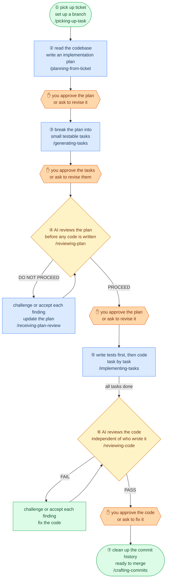

# coding-agent-skills

Skills for AI coding agents. A Jira-to-PR pipeline with self-review gates at every artifact boundary and an independent AI judge before you ship.

> *Review early, review often.* A flaw surfaced before coding costs nothing. The same flaw after five tasks can invalidate all five.

Works with Claude Code, OpenCode, Cursor, and GitHub Copilot.

## Agentic Coding Workflow



## Design Principles

**Review early, review often.** A flaw before coding costs nothing. The same flaw after five tasks can invalidate all five.

**Two review tiers, split by role.** Self-review handles mechanical checks: cheap, always runs, catches placeholders and format issues. AI-as-judge handles subjective quality calls: fresh context, targeted, catches design and scope problems. Neither replaces the other.

**Human gates are not optional.** Every AI verdict requires your approval before the next step starts. `REVIEW-LOG.md` is the audit trail.

**No self-preference bias.** Judge subagents run in a fresh context with no access to the producing session's framing or justifications.

**Auto mode removes pauses, not safeguards.** Git boundaries and judge halts hold in both modes. `auto` is a speed setting, not a bypass.

**Enter at any step.** Every skill is independently usable. Start wherever the upstream artifact already exists.

## Use cases

**Full pipeline** — ticket in, reviewed code out. Enter at any step if the upstream artifact already exists.

**Standalone review** — review any branch or PR without a plan file. Domain-filtered diff, triage-first report with BLOCKER / SHOULD-FIX / NIT severity.

**Architecture docs** — generate a design document from an existing codebase.

## Installation

```bash
git clone git@github.com:mhihasan/coding-agent-skills.git
cd coding-agent-skills

# User scope — available in all projects
./install.sh --scope=user --tool=claude     # → ~/.claude/skills/   (Claude Code, OpenCode, Cursor)
./install.sh --scope=user --tool=copilot    # → ~/.copilot/skills/  (GitHub Copilot)
./install.sh --scope=user --tool=all        # → both

# Project scope — current project only
./install.sh --scope=project --tool=claude  /path/to/project   # → .claude/skills/
./install.sh --scope=project --tool=copilot /path/to/project   # → .github/skills/
./install.sh --scope=project --tool=all     /path/to/project   # → both
```

Safe to re-run: existing symlinks are updated, real directories are never overwritten.

## Quickstart

**Option A: full pipeline from a Jira ticket**

```bash
/picking-up-task https://yoursite.atlassian.net/browse/PROJ-123

# Each skill tells you what to run next. The full sequence:
# /planning-from-ticket → /generating-tasks → /reviewing-plan
# → /implementing-tasks → /reviewing-code → /crafting-commits
```

Each skill is independently usable — enter at any point if the upstream artifact already exists.

---

**Option B: review any branch right now**

```
/reviewing-code
```

Reviews your staged diff by default, or pass `branch`, a PR number, or a diff file. Dispatches parallel AI judges, filters the diff by domain, and produces a triage-first report. No plan file needed.

## Skills Reference

Per-skill input/output tables, flags, usage examples, and flow details: [SKILLS.md](docs/SKILLS.md).

## Collaborative vs auto mode

Every pipeline skill accepts an optional `auto` argument. **Collaborative is the default.**

| | Collaborative | Auto |
|---|---|---|
| Forward-progress pauses (approve plan, confirm test plan, triage scope) | Pause for human | Proceed on own judgment |
| Git writes (commit / push / merge / PR) | Human-initiated | **Never self-initiated** |
| Destructive overwrite of existing PLAN file | Ask | **Ask** |
| Judge halt (DO NOT PROCEED / FAIL verdict) | Halt | **Halt** |
| Unresolvable ambiguity | Ask | **Ask** |

`auto` removes conversational pauses but does not remove safeguards. Git boundaries and judge halts are invariants in both modes.

**`auto` does not chain skills.** Even in auto mode, each skill is a discrete command. `/picking-up-task PROJ-123` fetches the ticket, sets up the branch, and stops. You decide when to invoke the next step.

## Review tiers

| Tier | Who | Scope | When |
|---|---|---|---|
| **Self-review** | The producing skill checks its own output | Objective, mechanical checks only (placeholders, file coverage, format): verifiable yes/no | Every artifact boundary; runs in both modes |
| **AI-as-judge** | Independent fresh-context subagent on a strong model | Subjective quality calls (scope, over-engineering, breaking changes, design) with BLOCKER/SHOULD-FIX/NIT severity gate | `reviewing-plan` (before code) · `reviewing-code` (after code) |

Self-review is cheap and always runs. AI-as-judge is targeted. The split exists because a producer evaluating its own subjective quality is the primary failure mode in AI evaluation.

## Model selection

In Claude Code, each skill pins its own model — you don't need to switch manually. Other tools (OpenCode, Cursor, Copilot) ignore the `model` field and use their session model.

| Skill | Model | Why |
|---|---|---|
| `picking-up-task` | Haiku | Mechanical: fetch ticket, create file |
| `generating-tasks` | Sonnet | Task decomposition, no deep design judgment needed |
| `implementing-tasks` | Sonnet | TDD cycle needs solid reasoning, not Opus-level |
| `crafting-commits` | Haiku | Mechanical: read history, format commits |
| `planning-from-ticket` | Opus | Highest-stakes reasoning: codebase exploration + design decisions |
| `reviewing-plan` | Opus | Subjective judgment before any code is written |
| `reviewing-code` | Opus | Where self-preference bias gets caught — model quality matters most here |
