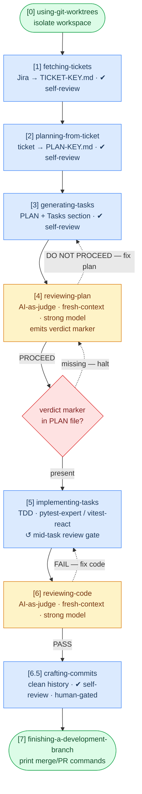

# coding-agent-skills

**Skills for AI coding agents.** A full Jira-to-PR pipeline with self-review gates at every artifact boundary and an independent AI-as-judge before you ship.

> *Review early, review often.* A flaw surfaced before coding costs nothing. The same flaw surfaced after five tasks can invalidate all five.

Works with Claude Code, OpenCode, Cursor, and any tool that reads `~/.claude/skills/`.

## Use cases

**Agentic workflow**
- Pull a Jira ticket, plan it, generate TDD tasks, implement, review, and open a PR without leaving the agent
- Enter the pipeline at any step. If you already have a plan file, skip straight to implementation

**Code review**
- Review a branch before opening a PR: parallel AI judges, domain-filtered diff, triage-first report with BLOCKER/SHOULD-FIX/NIT severity
- Review any existing PR or diff without needing a plan file

**Planning & design**
- Turn a ticket or spec into a structured implementation plan with scope, risks, and breaking changes surfaced upfront
- Block implementation until the plan passes an AI-as-judge gate. Never implement a flawed design
- Generate an architecture design doc from an existing codebase

**Implementation**
- Execute TDD tasks one by one. Auto-selects pytest or Vitest, enforces the TDD Iron Law (no code before a failing test)
- Dispatch parallel agents on multi-failure test runs instead of fixing one failure at a time

**Craft coaching**
- Architecture review: Dependency Rule violations, boundary placement, Clean Architecture compliance
- DDD modeling: identify Aggregates, Bounded Contexts, and Ubiquitous Language gaps in a codebase
- System design Q&A grounded in DDIA, covering replication, sharding, consistency, stream processing
- Code quality critique using Clean Code and Pragmatic Programmer lens on functions, naming, error handling

**Commit hygiene**
- Rewrite a messy branch history into clean conventional commits, human-gated before anything is pushed

## Quickstart

**Option A: review any branch right now (zero setup)**

```
/reviewing-code branch
```

Point it at your current branch. It dispatches parallel AI judges, filters the diff by domain, and produces a triage-first report. No plan file needed.

---

**Option B: full pipeline from a Jira ticket**

```bash
# 1. Install dependencies
/plugin install superpowers@claude-plugins-official       # in Claude Code
/plugin marketplace add mhihasan/coding-agent-skills      # in Claude Code
/plugin install coding-agent-skills@coding-agent-skills   # in Claude Code

# 2. Pull a ticket
/fetching-tickets https://yoursite.atlassian.net/browse/PROJ-123

# 3. Plan it
/planning-from-ticket tickets/PROJ-123/PROJ-123.md

# 4. Generate TDD tasks
/generating-tasks tickets/PROJ-123/PLAN-PROJ-123.md

# 5. Judge the plan (AI-as-judge, blocks implementation if findings are blockers)
/reviewing-plan tickets/PROJ-123/PLAN-PROJ-123.md

# 6. Implement (refuses to start without a PROCEED verdict marker)
/implementing-tasks tickets/PROJ-123/PLAN-PROJ-123.md auto

# 7. Review the code
/reviewing-code branch

# 8. Clean up commits
/crafting-commits
```

Each step is independently usable. Enter at any point if the upstream artifact already exists.

## Skills Reference

### `fetching-tickets`

Pulls a Jira ticket to a local markdown file with all images downloaded.

| | |
|---|---|
| **Input** | Jira ticket URL or key (`PROJ-123`) |
| **Output** | `tickets/PROJ-123/PROJ-123.md` + `tickets/PROJ-123/images/` |
| **Auto mode** | Supported, fetches without pausing |
| **Requires** | `JIRA_EMAIL` and `JIRA_API_TOKEN` env vars |

```bash
/fetching-tickets https://yoursite.atlassian.net/browse/PROJ-123
/fetching-tickets PROJ-123
```

---

### `planning-from-ticket`

Turns a local ticket file into a structured implementation plan. Explores the codebase, surfaces decisions, and writes a `PLAN-<KEY>.md` beside the ticket.

| | |
|---|---|
| **Input** | Local ticket file (`tickets/PROJ-123/PROJ-123.md`) |
| **Output** | `tickets/PROJ-123/PLAN-PROJ-123.md` |
| **Auto mode** | Supported, picks recommended option and skips chat presentation |

```bash
/planning-from-ticket tickets/PROJ-123/PROJ-123.md
/planning-from-ticket tickets/PROJ-123/PROJ-123.md auto
```

---

### `generating-tasks`

Appends TDD-ready task specs into an existing plan file. Each task includes a test plan, scope boundaries, and files expected.

| | |
|---|---|
| **Input** | Plan file (`tickets/PROJ-123/PLAN-PROJ-123.md`) |
| **Output** | `# Tasks` section appended to the same plan file |
| **Auto mode** | Supported, drafts and appends without pausing |

```bash
/generating-tasks tickets/PROJ-123/PLAN-PROJ-123.md
/generating-tasks tickets/PROJ-123/PLAN-PROJ-123.md auto
```

---

### `reviewing-plan`

AI-as-judge that evaluates the plan + tasks against the ticket before any code is written. Dispatches a fresh-context subagent to avoid self-preference bias.

| | |
|---|---|
| **Input** | Plan file with tasks (reads the ticket file alongside it automatically) |
| **Output** | Verdict report with BLOCKER/SHOULD-FIX/NIT findings; appends `> **Plan Review:** PROCEED — YYYY-MM-DD` marker to the plan on pass |
| **Auto mode** | Supported, appends verdict marker automatically; halts on DO NOT PROCEED regardless |
| **Verdict** | `PROCEED` / `PROCEED WITH CHANGES` / `DO NOT PROCEED` |

```bash
/reviewing-plan tickets/PROJ-123/PLAN-PROJ-123.md
```

`implementing-tasks` refuses to start without a PROCEED marker in the plan file.

---

### `implementing-tasks`

Implements a task spec via TDD. Auto-selects `pytest-expert` (Python) or `vitest-react` (React) and enforces RED → GREEN → REFACTOR per test.

| | |
|---|---|
| **Input** | Plan file + task number (`T1`, `T2`, …) |
| **Output** | Working code with passing tests; task status updated to `done` in plan file |
| **Auto mode** | Supported, runs full TDD cycle without pausing; stops on unexpected failures |
| **Requires** | PROCEED verdict marker in plan file |

```bash
/implementing-tasks tickets/PROJ-123/PLAN-PROJ-123.md        # collaborative, pauses for approval
/implementing-tasks tickets/PROJ-123/PLAN-PROJ-123.md auto   # auto, no forward-progress pauses
```

Never self-commits or pushes. Code is left staged/unstaged for you to review.

---

### `reviewing-code`

Triage-first code review. Dispatches parallel AI judges filtered by domain (TypeScript agent sees `.tsx/.jsx`, DB agent sees query/model files, etc.).

| | |
|---|---|
| **Input** | Branch name, PR number, staged diff, or diff file; optionally a plan/spec file for pipeline context (ticket file read automatically if found beside the plan) |
| **Output** | `CODE-REVIEW-{identifier}.md` with severity-tiered findings (🔴 Critical → ⚠️ Manual) |
| **Auto mode** | Supported, skips triage confirmation and proceeds directly to review |
| **Verdict** | Pipeline: `PASS` / `PASS WITH FINDINGS` / `FAIL` · General: `APPROVE` / `APPROVE WITH COMMENTS` / `REQUEST CHANGES` |

```bash
/reviewing-code branch                                             # review current branch against main
/reviewing-code PR-456                                             # review a specific PR
/reviewing-code branch tickets/PROJ-123/PLAN-PROJ-123.md          # pipeline mode with plan context
```

---

### `crafting-commits`

Rewrites a messy branch history into clean conventional commits. Produces a human-readable plan and never runs git commands without your approval.

| | |
|---|---|
| **Input** | Current git branch (reads history automatically) |
| **Output** | `tickets/<TICKET>/commit-plan-<TICKET>.md` if the ticket directory exists, otherwise `local-dev/plans/commit-plan-<TICKET>.md`; contains proposed commit sequence and a ready-to-run bash script |
| **Auto mode** | Supported, produces plan without pausing; always halts before executing any git commands |

```bash
/crafting-commits
/crafting-commits auto
```

Review the plan, then run the generated script yourself.

---

### Collaborative vs auto mode

Every pipeline skill accepts an optional `auto` argument. **Collaborative is the default.**

| | Collaborative | Auto |
|---|---|---|
| Forward-progress pauses (approve plan, confirm test plan, triage scope) | Pause for human | Proceed on own judgment |
| Git writes (commit / push / merge / PR) | Human-initiated | **Never self-initiated** |
| Destructive overwrite of existing PLAN file | Ask | **Ask** |
| Judge halt (DO NOT PROCEED / FAIL verdict) | Halt | **Halt** |
| Unresolvable ambiguity | Ask | **Ask** |

`auto` removes conversational pauses but does not remove safeguards. Git boundaries and judge halts are invariants in both modes.

**`auto` does not chain skills.** Even in auto mode, each skill is a discrete command. `/fetching-tickets auto` fetches the ticket and stops. You decide when to invoke the next step.

## Agentic Coding Workflow

These skills chain into a single feature-development pipeline: ticket in, reviewed code out.



> 🔵 pipeline steps · 🟡 AI-as-judge · 🟢 superpowers steps · dotted = fix & retry

## Composes with superpowers

This pipeline is the **spine**: artifact-centric, Jira-native, resumable. The
[superpowers plugin](https://claude.com/plugins/superpowers) provides cross-cutting
discipline at key points (TDD Iron Law, debugging, verification, git worktrees, close-out).

**The superpowers plugin is a required dependency for the full pipeline.**

Install in Claude Code:

```
/plugin install superpowers@claude-plugins-official
```

Then re-run `./install.sh` here.

### Review tiers

The pipeline uses two complementary review layers, split to avoid self-preference bias:

| Tier | Who | Scope | When |
|---|---|---|---|
| **Self-review** | The producing skill checks its own output | Objective, mechanical checks only (placeholders, file coverage, format): verifiable yes/no | Every artifact boundary; runs in both modes |
| **AI-as-judge** | Independent fresh-context subagent on a strong model | Subjective quality calls (scope, over-engineering, breaking changes, design) with BLOCKER/SHOULD-FIX/NIT severity gate | `reviewing-plan` (before code) · `reviewing-code` (after code) |

Self-review is cheap and always runs. AI-as-judge is expensive and targeted. The split exists because a producer judging its own subjective quality is the strongest failure mode in AI evaluation (self-preference bias).

### Superpowers sub-skills

| Step | Requires / adopts |
|---|---|
| [2] `planning-from-ticket` | REQUIRED: `superpowers:brainstorming` · ADOPT: `superpowers:writing-plans` rigor |
| [3] `generating-tasks` | ADOPT: `superpowers:writing-plans` bite-sized-task discipline |
| [5] `implementing-tasks` | REQUIRED: `superpowers:test-driven-development` + `pytest-expert` / `vitest-react` · `superpowers:systematic-debugging` on wrong-reason RED · `superpowers:dispatching-parallel-agents` on multi-failures · `superpowers:verification-before-completion` before marking done · `superpowers:requesting-code-review` mid-task |
| [6] `reviewing-code` | ADOPT: `superpowers:requesting-code-review` (SHA convention) · `superpowers:receiving-code-review` (verify-before-fix) |

### Recommended model tiers

Skills keep `model: inherit` (honoring your session model). Judge subagents are dispatched with a strong model at dispatch time, not pinned in brittle frontmatter.

| Step | Role | Recommended tier |
|---|---|---|
| `fetching-tickets`, `generating-tasks` | Mechanical / extraction | Any capable model |
| `planning-from-ticket`, `crafting-commits` | Reasoning + writing | Default session model |
| `implementing-tasks` | TDD cycle | Default session model |
| `reviewing-plan` judge subagent | Subjective quality judgment | **Strong model** (e.g. `claude-opus-4-8`) |
| `reviewing-code` check subagents | Subjective quality judgment | **Strong model** (e.g. `claude-opus-4-8`) |

## Craft Skills

Standalone, book-grounded skills usable on their own or within the workflow above.

| Skill | Grounded in |
|---|---|
| `clean-architecture` | Robert C. Martin, *Clean Architecture* (2017) |
| `clean-coding` | Robert C. Martin, *Clean Code* (2008) |
| `ddd-expert` | Eric Evans, *Domain-Driven Design* (2003) |
| `design-patterns-expert` | Alexander Shvets, *Dive Into Design Patterns* (2022) |
| `design-doc-generator` | Generates production-grade architecture docs from a codebase |
| `pragmatic-engineer` | Thomas & Hunt, *The Pragmatic Programmer* (2019) |
| `system-designing` | Kleppmann & Riccomini, *Designing Data-Intensive Applications* (2nd ed.) |
| `pytest-expert` | Opinionated pytest best practices for Python |
| `vitest-react` | Unit testing for React + Vitest + TypeScript projects |

## Installation

**Option A: Claude Code plugin (recommended)**

```shell
/plugin marketplace add mhihasan/coding-agent-skills
/plugin install coding-agent-skills@coding-agent-skills
```

**Option B: manual symlink (OpenCode, Cursor, any tool reading `~/.claude/skills/`)**

```bash
git clone git@github.com:mhihasan/coding-agent-skills.git
cd coding-agent-skills
./install.sh
```

`install.sh` symlinks all skills into `~/.claude/skills/`. Safe to re-run: existing symlinks are updated, real directories are never overwritten.
