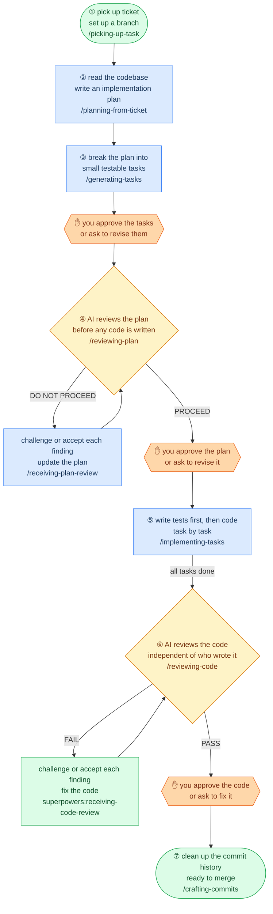

# coding-agent-skills

**Skills for AI coding agents.** A full Jira-to-PR pipeline with self-review gates at every artifact boundary and an independent AI-as-judge before you ship.

> *Review early, review often.* A flaw surfaced before coding costs nothing. The same flaw surfaced after five tasks can invalidate all five.

Works with Claude Code, OpenCode, Cursor, and GitHub Copilot.

## Agentic Coding Workflow

Ticket in, reviewed code out.



## Design Principles

**Review early, review often.** A flaw surfaced before coding costs nothing. The same flaw after five tasks can invalidate all five.

**Two review tiers, split by role.** Self-review handles mechanical checks — cheap, always runs, catches placeholders and format issues. AI-as-judge handles subjective quality calls — fresh context, targeted, catches design and scope problems. Neither replaces the other.

**Human gates are not optional.** Every AI verdict requires your approval before the next step starts. `REVIEW-LOG.md` is the audit trail.

**No self-preference bias.** Judge subagents run in a fresh context with no access to the producing session's framing or justifications.

**Auto mode removes pauses, not safeguards.** Git boundaries and judge halts are invariants in both modes. `auto` is a workflow speed setting, not a bypass.

**Enter at any step.** Every skill is independently usable. The pipeline is resumable, not monolithic — start wherever the upstream artifact already exists.

## Use cases

**Full pipeline** — ticket in, reviewed code out. Enter at any step if the upstream artifact already exists.

**Standalone review** — review any branch or PR without a plan file: domain-filtered diff, triage-first report with BLOCKER / SHOULD-FIX / NIT severity.

**Architecture docs** — generate a production-grade design document from an existing codebase.

**Craft coaching** — book-grounded skills for architecture review (Clean Architecture), DDD modeling, system design Q&A (DDIA), and code quality critique (Clean Code, Pragmatic Programmer).

## Installation

```bash
git clone git@github.com:mhihasan/coding-agent-skills.git
cd coding-agent-skills

# User scope — available in all projects
./install.sh --scope=user --tool=claude     # → ~/.claude/skills/   (Claude Code, OpenCode, Cursor)
./install.sh --scope=user --tool=copilot    # → ~/.copilot/skills/  (GitHub Copilot)
./install.sh --scope=user --tool=all        # → both

# Project scope — current project only
./install.sh --scope=project --tool=claude  /path/to/project   # → .claude/skills/
./install.sh --scope=project --tool=copilot /path/to/project   # → .github/skills/
./install.sh --scope=project --tool=all     /path/to/project   # → both
```

Safe to re-run: existing symlinks are updated, real directories are never overwritten.

## Quickstart

**Option A: full pipeline from a Jira ticket**

```bash
/picking-up-task https://yoursite.atlassian.net/browse/PROJ-123

# Each skill tells you what to run next. The full sequence:
# /planning-from-ticket → /generating-tasks → /reviewing-plan
# → /implementing-tasks → /reviewing-code → /crafting-commits
```

Each skill is independently usable — enter at any point if the upstream artifact already exists.

---

**Option B: review any branch right now**

```
/reviewing-code
```

Reviews your staged diff by default, or pass `branch`, a PR number, or a diff file. Dispatches parallel AI judges, filters the diff by domain, and produces a triage-first report. No plan file needed.

## Skills Reference

### `picking-up-task`

Fetches a Jira ticket (or reads a local file) and sets up a git branch — the single entry point for starting any new task.

| | |
|---|---|
| **Input** | Jira ticket URL, Jira key (`PROJ-123`), or local file path |
| **Output** | `local-dev/tickets/PROJ-123/PROJ-123.md` + branch `{type}/PROJ-123/{slug}` |
| **Flags** | `--worktree` — create a git worktree instead of a plain branch |
| **Requires** | `JIRA_EMAIL` and `JIRA_API_TOKEN` env vars (for Jira inputs) |

```bash
/picking-up-task https://yoursite.atlassian.net/browse/PROJ-123
/picking-up-task PROJ-123
/picking-up-task PROJ-123 --worktree
/picking-up-task ./local-dev/tickets/PROJ-123/PROJ-123.md
```

---

### `planning-from-ticket`

Turns a local ticket file into a structured implementation plan. Explores the codebase, surfaces decisions, and writes a `PLAN-<KEY>.md` beside the ticket.

| | |
|---|---|
| **Input** | Local ticket file (`local-dev/tickets/PROJ-123/PROJ-123.md`) |
| **Output** | `local-dev/tickets/PROJ-123/PLAN-PROJ-123.md` |
| **Auto mode** | Supported, picks recommended option and skips chat presentation |

```bash
/planning-from-ticket local-dev/tickets/PROJ-123/PROJ-123.md
/planning-from-ticket local-dev/tickets/PROJ-123/PROJ-123.md auto
```

---

### `generating-tasks`

Appends TDD-ready task specs into an existing plan file. Each task includes a test plan, scope boundaries, and files expected.

| | |
|---|---|
| **Input** | Plan file (`local-dev/tickets/PROJ-123/PLAN-PROJ-123.md`) |
| **Output** | `# Tasks` section appended to the same plan file |
| **Auto mode** | Supported, drafts and appends without pausing |
| **Writes** | `generating-tasks` stamp in `REVIEW-LOG.md` after you approve |

```bash
/generating-tasks local-dev/tickets/PROJ-123/PLAN-PROJ-123.md
/generating-tasks local-dev/tickets/PROJ-123/PLAN-PROJ-123.md auto
```

---

### `reviewing-plan`

AI-as-judge that evaluates the plan + tasks against the ticket before any code is written. Dispatches a fresh-context subagent to avoid self-preference bias.

| | |
|---|---|
| **Input** | Plan file with tasks (reads the ticket file alongside it automatically) |
| **Output** | Verdict report with BLOCKER/SHOULD-FIX/NIT findings; appends `> **Plan Review:** PROCEED — YYYY-MM-DD` marker to the plan on pass |
| **Auto mode** | Supported, appends verdict marker automatically; on DO NOT PROCEED automatically invokes `receiving-plan-review`, fixes the plan, and re-runs review |
| **Verdict** | `PROCEED` / `PROCEED WITH CHANGES` / `DO NOT PROCEED` |
| **Checks** | `generating-tasks` stamp in `REVIEW-LOG.md` |
| **Writes** | `reviewing-plan` stamp in `REVIEW-LOG.md` after you approve |

```bash
/reviewing-plan local-dev/tickets/PROJ-123/PLAN-PROJ-123.md
```

`implementing-tasks` refuses to start without a PROCEED marker in the plan file.

**If the verdict is DO NOT PROCEED (collaborative mode):**

1. Use `receiving-plan-review` to work through the findings:
   - Verify each finding against the ticket ACs and codebase before accepting it
   - Push back with evidence if a finding is wrong
   - Fix only findings that hold up under scrutiny
2. Re-run `/reviewing-plan` — fresh verdict against the updated plan
3. Once verdict is PROCEED, continue to `implementing-tasks`

---

### `receiving-plan-review`

Works through `reviewing-plan` findings with technical rigor. Verifies each finding against the ticket and codebase before accepting it — pushes back on wrong findings, fixes genuine ones.

| | |
|---|---|
| **Input** | Plan review findings (from `reviewing-plan` output) + ticket file + plan file |
| **Output** | Per-finding verdict (accept / push back) with targeted plan edits; prompt to re-run `reviewing-plan` |

```bash
# Invoke after a DO NOT PROCEED or PROCEED WITH CHANGES verdict
receiving-plan-review
```

---

### `implementing-tasks`

Implements a task spec via TDD. Auto-selects `testing-pytest` (Python) or `testing-vitest` (React) and enforces RED → GREEN → REFACTOR per test.

| | |
|---|---|
| **Input** | Plan file + task number (`T1`, `T2`, …) |
| **Output** | Working code with passing tests; task status updated to `done` in plan file |
| **Auto mode** | Supported, runs full TDD cycle without pausing; stops on unexpected failures |
| **Requires** | PROCEED verdict marker in plan file |
| **Checks** | `reviewing-plan` stamp in `REVIEW-LOG.md` |

```bash
/implementing-tasks local-dev/tickets/PROJ-123/PLAN-PROJ-123.md        # collaborative, pauses for approval
/implementing-tasks local-dev/tickets/PROJ-123/PLAN-PROJ-123.md auto   # auto, no forward-progress pauses
```

Never self-commits or pushes. Code is left staged/unstaged for you to review.

---

### `reviewing-code`

Triage-first code review. Dispatches parallel AI judges filtered by domain (TypeScript agent sees `.tsx/.jsx`, DB agent sees query/model files, etc.).

| | |
|---|---|
| **Input** | Branch name, PR number, staged diff, or diff file — defaults to staged diff if no target given; optionally a plan/spec file for pipeline context (ticket file read automatically if found beside the plan) |
| **Output** | `CODE-REVIEW-{identifier}.md` with severity-tiered findings (🔴 Critical → ⚠️ Manual) |
| **Auto mode** | Supported, skips triage confirmation and proceeds directly to review; on FAIL automatically invokes `superpowers:receiving-code-review`, fixes findings, and re-runs review |
| **Verdict** | Pipeline: `PASS` / `PASS WITH FINDINGS` / `FAIL` · General: `APPROVE` / `APPROVE WITH COMMENTS` / `REQUEST CHANGES` |
| **Writes** | `reviewing-code` stamp in `REVIEW-LOG.md` after you approve |

```bash
/reviewing-code                                                    # review staged diff (default)
/reviewing-code branch                                             # review current branch against main
/reviewing-code PR-456                                             # review a specific PR
/reviewing-code branch local-dev/tickets/PROJ-123/PLAN-PROJ-123.md          # pipeline mode with plan context
```

**If the verdict is FAIL (collaborative mode):**

1. Use `superpowers:receiving-code-review` to work through the findings:
   - Verify each finding against the actual code before accepting it
   - Push back with technical reasoning if a finding is wrong
   - Fix only findings that hold up under scrutiny
2. Re-run `/reviewing-code` — it produces a delta report against the original, not a full re-review
3. Once verdict is PASS, continue to `crafting-commits`

---

### `crafting-commits`

Rewrites a messy branch history into clean conventional commits. Presents the plan in chat for approval, never runs git commands without your confirmation, then reminds you to run `superpowers:finishing-a-development-branch`.

| | |
|---|---|
| **Input** | Current git branch (reads history automatically) |
| **Output** | Commit plan presented in chat with proposed sequence and ready-to-run bash script |
| **Auto mode** | Supported, produces plan without pausing; always halts before executing any git commands |
| **Checks** | `reviewing-code` stamp in `REVIEW-LOG.md` |

```bash
/crafting-commits
/crafting-commits auto
```

Review the plan in chat, confirm, and the script runs. Reminds you to run `superpowers:finishing-a-development-branch` when ready.

---

## Collaborative vs auto mode

Every pipeline skill accepts an optional `auto` argument. **Collaborative is the default.**

| | Collaborative | Auto |
|---|---|---|
| Forward-progress pauses (approve plan, confirm test plan, triage scope) | Pause for human | Proceed on own judgment |
| Git writes (commit / push / merge / PR) | Human-initiated | **Never self-initiated** |
| Destructive overwrite of existing PLAN file | Ask | **Ask** |
| Judge halt (DO NOT PROCEED / FAIL verdict) | Halt | **Halt** |
| Unresolvable ambiguity | Ask | **Ask** |

`auto` removes conversational pauses but does not remove safeguards. Git boundaries and judge halts are invariants in both modes.

**`auto` does not chain skills.** Even in auto mode, each skill is a discrete command. `/picking-up-task PROJ-123` fetches the ticket, sets up the branch, and stops. You decide when to invoke the next step.

## Composes with superpowers

This pipeline is the **spine**: artifact-centric, Jira-native, resumable. The
[superpowers plugin](https://claude.com/plugins/superpowers) provides cross-cutting
discipline at key points (TDD Iron Law, debugging, verification, git worktrees, close-out).

**The superpowers plugin is a required dependency for the full pipeline.**

Install in Claude Code:

```
/plugin install superpowers@claude-plugins-official
```

Then re-run `./install.sh` here.

### Review tiers

The pipeline uses two complementary review layers, split to avoid self-preference bias:

| Tier | Who | Scope | When |
|---|---|---|---|
| **Self-review** | The producing skill checks its own output | Objective, mechanical checks only (placeholders, file coverage, format): verifiable yes/no | Every artifact boundary; runs in both modes |
| **AI-as-judge** | Independent fresh-context subagent on a strong model | Subjective quality calls (scope, over-engineering, breaking changes, design) with BLOCKER/SHOULD-FIX/NIT severity gate | `reviewing-plan` (before code) · `reviewing-code` (after code) |

Self-review is cheap and always runs. AI-as-judge is expensive and targeted. The split exists because a producer judging its own subjective quality is the strongest failure mode in AI evaluation (self-preference bias).

### Superpowers sub-skills

| Step | Requires / adopts |
|---|---|
| [2] `planning-from-ticket` | REQUIRED: `superpowers:brainstorming` · ADOPT: `superpowers:writing-plans` rigor |
| [3] `generating-tasks` | ADOPT: `superpowers:writing-plans` bite-sized-task discipline |
| [4] `reviewing-plan` | ON DO NOT PROCEED: `receiving-plan-review` (verify-before-fix) |
| [5] `implementing-tasks` | REQUIRED: `superpowers:test-driven-development` + `testing-pytest` / `testing-vitest` · `superpowers:systematic-debugging` on wrong-reason RED · `superpowers:dispatching-parallel-agents` on multi-failures · `superpowers:verification-before-completion` before marking done · `superpowers:requesting-code-review` mid-task |
| [6] `reviewing-code` | ON FAIL: `superpowers:receiving-code-review` (verify-before-fix) · ADOPT: `superpowers:requesting-code-review` (SHA convention) |

### Recommended model tiers

Skills keep `model: inherit` (honoring your session model). Judge subagents are dispatched with a strong model at dispatch time, not pinned in brittle frontmatter.

| Step | Role | Recommended tier |
|---|---|---|
| `picking-up-task`, `generating-tasks` | Mechanical / extraction | Any capable model |
| `planning-from-ticket`, `crafting-commits` | Reasoning + writing | Default session model |
| `implementing-tasks` | TDD cycle | Default session model |
| `reviewing-plan` judge subagent | Subjective quality judgment | **Strong model** (e.g. `claude-opus-4-8`) |
| `reviewing-code` check subagents | Subjective quality judgment | **Strong model** (e.g. `claude-opus-4-8`) |

## Book Skills

Standalone coaching skills in `book-skills/`. Each is grounded in a specific book and usable independently — invoke them for architecture review, DDD coaching, design critique, and system design Q&A.

Install manually by symlinking from `book-skills/` into `~/.claude/skills/`.

| Skill | Grounded in |
|---|---|
| `clean-architecture` | Robert C. Martin, *Clean Architecture* (2017) |
| `clean-coding` | Robert C. Martin, *Clean Code* (2008) |
| `ddd-expert` | Eric Evans, *Domain-Driven Design* (2003) |
| `design-patterns-expert` | Alexander Shvets, *Dive Into Design Patterns* (2022) |
| `pragmatic-engineer` | Thomas & Hunt, *The Pragmatic Programmer* (2019) |
| `system-designing` | Kleppmann & Riccomini, *Designing Data-Intensive Applications* (2nd ed.) |
